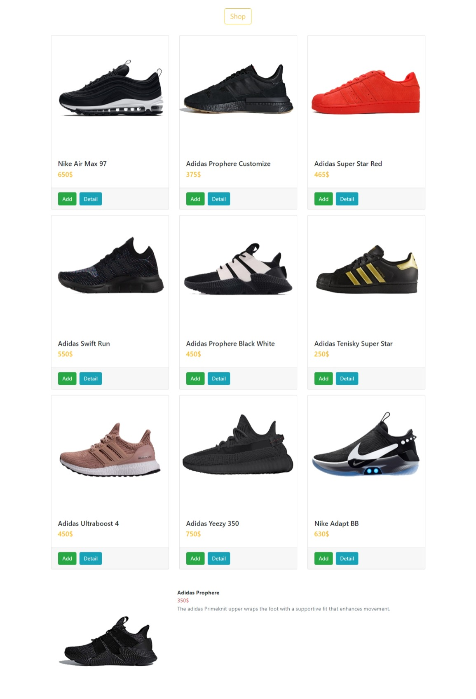

# Mini Shop


<div align="center">
  
</div>

## Branch
- master: redux basics.
- redux_CRUD: redux and call API.
- reduxSaga_CRUD_axios_fetch: redux, redux sagas, call API with axios or fetch.
- reduxToolkit: reduxToolkit basics.
- redux_reduxThunk_CRUD: redux, reduxThunk, call API.
- react-query : call API with fetch,do not use Redux (function component)
- all branches written with class component except react-query
## Install

In the project directory, you can run:

```sh
npm i
npm start
```

Open [http://localhost:3000](http://localhost:3000) to view it in your browser.
